# WeeklyPulse — Architecture

## Overview

WeeklyPulse is an **AI agent** orchestrated in Cursor (or compatible host) that runs a repeatable pipeline: load public app-store review exports → analyze themes → generate a weekly pulse → publish via **MCP** to Google Docs and Gmail. The agent uses **tools** (local scripts + MCP servers); it does **not** embed Google API clients in the repository.

**Target app (MVP):** Groww — iOS App Store and Google Play.

**Primary output:** A ≤250-word weekly pulse with top 3 themes, 3 user quotes, and 3 action ideas—delivered as a Google Doc and Gmail draft for human review.

---

## Architecture diagrams

Three views of the same system: **who and what** (context), **stages and data** (pipeline), and **order of interactions over time** (sequence).

| Diagram | Purpose |
|---------|---------|
| [Context](#context-diagram) | External actors, system boundary, integrations |
| [Pipeline](#pipeline-diagram) | Processing stages, artifacts, gates |
| [Sequence](#sequence-diagram) | Weekly run timeline from export to send |

---

### Context diagram

Shows WeeklyPulse inside its environment: operators, data sources, the agent host, local pipeline, and Google services reached **only via MCP**.

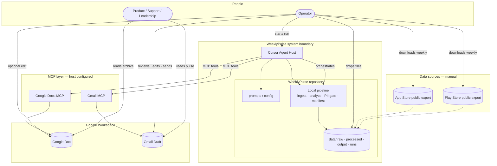

**Reading the diagram**

- **Outside the boundary:** store exports (public files), operator, stakeholders.
- **Inside the boundary:** agent host + repo (pipeline, data, prompts)—no Google credentials in the repo.
- **MCP layer:** bridge to Google; OAuth lives in the host, not in git.

---

### Pipeline diagram

End-to-end **processing pipeline**: stages, decision gates, artifacts, and delivery. Aligns with implementation Phases 2–5.

```mermaid
flowchart LR
    subgraph S0 [S0 Prepare]
        E1[App Store CSV/JSON]
        E2[Play Store CSV/JSON]
    end

    subgraph S1 [S1 Ingest]
        I1[Parse and normalize]
        I2[Merge iOS + Android]
        I3[Window filter 8-12 wks]
        A1[(reviews.jsonl)]
        E1 --> I1
        E2 --> I1
                I1 --> I2 --> I3 --> A1
    end

    subgraph S2 [S2 Analyze]
        N1[Theme cluster max 5]
        N1b[LLM label themes]
        N2[Rank top 3]
        N3[Pick 3 quotes]
        N3b[LLM generate actions]
        N4[Compose pulse]
        N4b[LLM polish pulse]
        A2[(themes.json)]
        A3[(pulse.md / pulse.json)]
        A1 --> N1 --> N1b --> A2 --> N2 --> N3 --> N3b --> N4 --> N4b --> A3
    end

    subgraph S3 [S3 Validate]
        G{PII gate}
        A3 --> G
    end

    subgraph S4 [S4 Deliver MCP]
        D1[Docs MCP]
        D2[(Google Doc)]
        D3[Gmail MCP]
        D4[(Gmail draft)]
        G -->|pass| D1 --> D2 --> D3 --> D4
    end

    subgraph S5 [S5 Close]
        M[(manifest.json)]
        H([Human review and send])
        D4 --> M --> H
    end

    G -->|fail| R[Scrub / regenerate pulse]
    R --> N4
```

**Stage summary**

| Stage | Input | Output | Owner |
|-------|--------|--------|--------|
| **S0 Prepare** | Store consoles (manual) | Files in `data/raw/` | Operator |
| **S1 Ingest** | Raw exports | `reviews.jsonl` | Pipeline |
| **S2 Analyze** | Reviews | `themes.json`, `pulse.md` | Pipeline + Groq LLM |
| **S3 Validate** | Pulse | Pass / fail | Pipeline (fail closed) |
| **S4 Deliver** | Scrubbed pulse | Doc + draft | Agent via MCP |
| **S5 Close** | Delivery refs | Manifest; human send | Pipeline + operator |

---

### Sequence diagram

**Time-ordered** interactions for one weekly run: operator, agent, local pipeline, and MCP servers (ADR-013: Docs before Gmail).

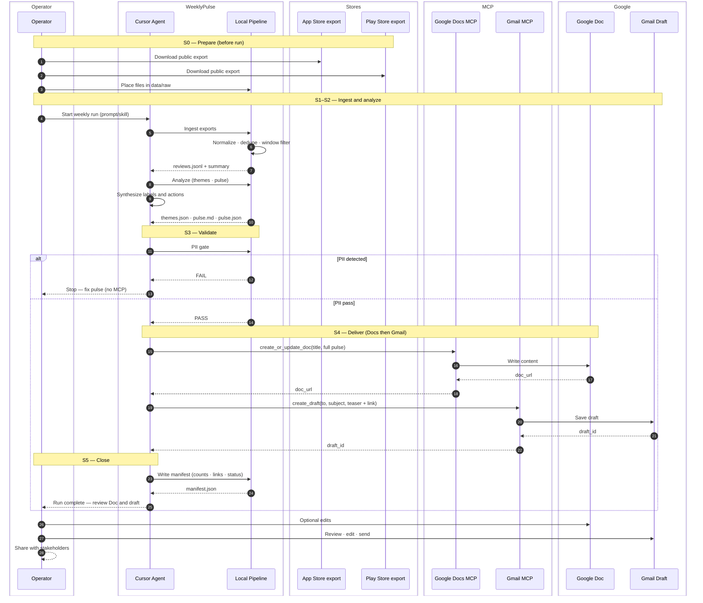

**Sequence notes**

- Steps **1–3:** operator-only; no agent required.
- Steps **4–8:** ingest and analyze; agent may call pipeline tools repeatedly until pulse is valid.
- Steps **9–10:** PII gate is mandatory; failure path skips all MCP calls.
- Steps **11–14:** delivery order fixed: Doc URL exists before draft body references it.
- Steps **15–17:** human always approves send (ADR-010).

---

## Business context

### Problem being solved

Store reviews accumulate faster than product teams can read them. WeeklyPulse compresses **8–12 weeks** of public Groww feedback into a **two-minute read** that highlights what matters this week and suggests what to do next—without exposing user identities.

### Stakeholders and outcomes

| Stakeholder | What they need | What WeeklyPulse provides |
|-------------|----------------|---------------------------|
| **Product / Growth** | Prioritized themes and next steps | Top 3 themes + 3 action ideas tied to real feedback |
| **Support** | Awareness of recurring complaints and praise | Quotes and themes aligned to support macros and FAQs |
| **Leadership** | Weekly health signal without raw data dumps | One-page pulse in email + archived Doc |
| **Operator** (runs the agent) | Repeatable, low-friction weekly ritual | Checklist-driven run, manifest, draft-ready email |

### What WeeklyPulse is not

- Not a real-time review monitoring or alerting system
- Not a substitute for App Store Connect / Play Console analytics
- Not an auto-reply or review response bot
- Not a scraping tool behind store logins

---

## Weekly operating cadence

Typical rhythm for the team operating WeeklyPulse:

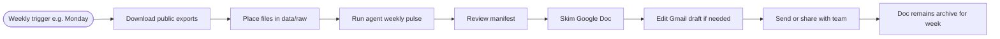

| When | Activity | Owner |
|------|----------|-------|
| Start of week | Download latest App Store + Play Store exports for Groww | Operator |
| Same day | Run full WeeklyPulse pipeline via Cursor agent | Operator + Agent |
| Within 30 min | Review manifest, Doc, and draft | Operator |
| After review | Send email or forward Doc link to stakeholders | Operator |
| Ongoing | Doc kept in Drive as that week’s record | — |

---

## Trust boundaries

What lives where—and what must never cross a boundary:

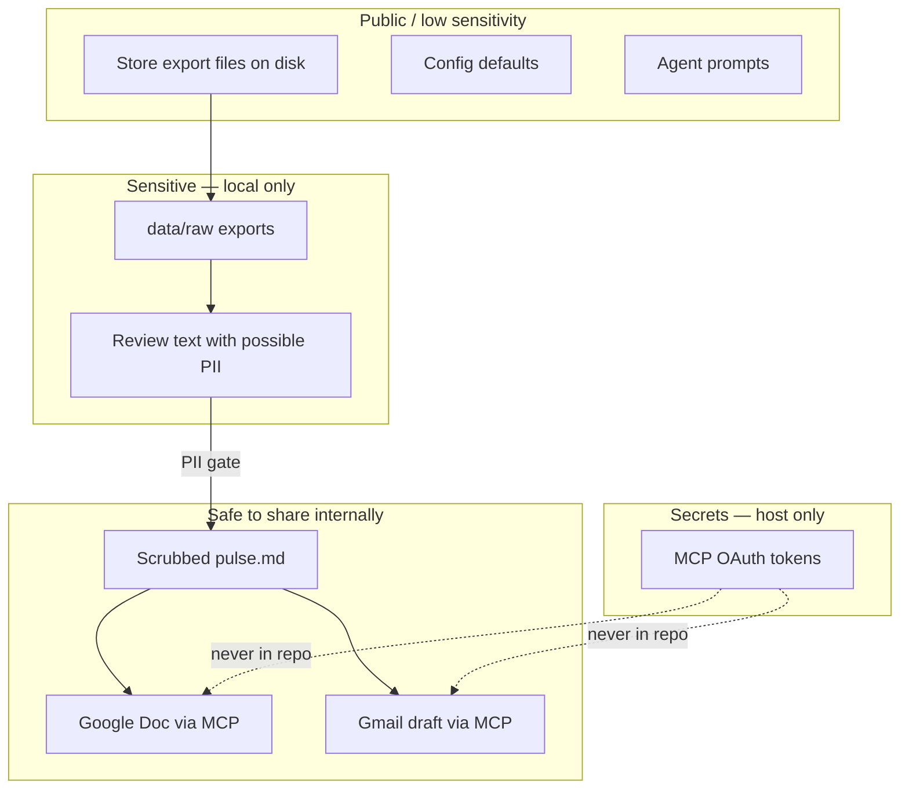

| Boundary | Rule |
|----------|------|
| **Repo** | Code, config, prompts, redacted manifests, fixtures—no raw exports, no tokens |
| **Local disk** | Full exports and processed reviews; treat as business-confidential |
| **Google (via MCP)** | Only PII-scrubbed pulse content |
| **Git** | Never commit `data/raw/`, `.env`, or MCP credentials |

---

## System flows

Primary views: **[Context](#context-diagram)**, **[Pipeline](#pipeline-diagram)**, and **[Sequence](#sequence-diagram)** diagrams above. Supplementary flows below.

### 1. Agent orchestration

What the AI agent drives versus deterministic code:

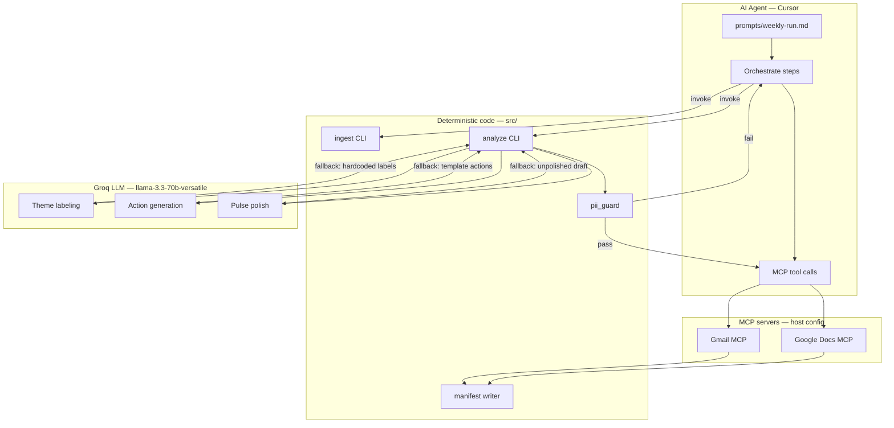

---

### 2. MCP delivery only (zoom-in)

Subset of the [sequence diagram](#sequence-diagram)—S4 deliver path after PII pass:

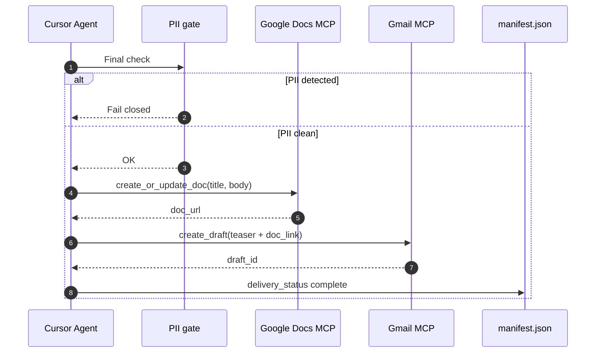

---

### 3. Data artifact flow

Files created and consumed at each stage:

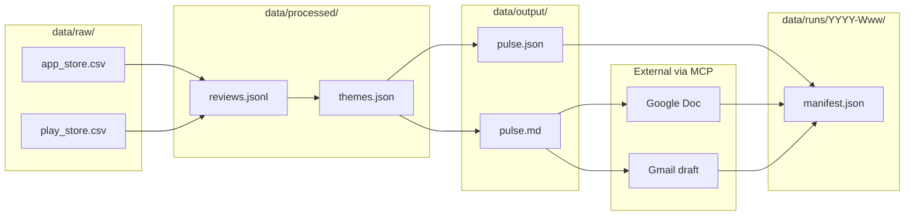

---

### 4. Failure and recovery flow

Decision paths when something goes wrong:

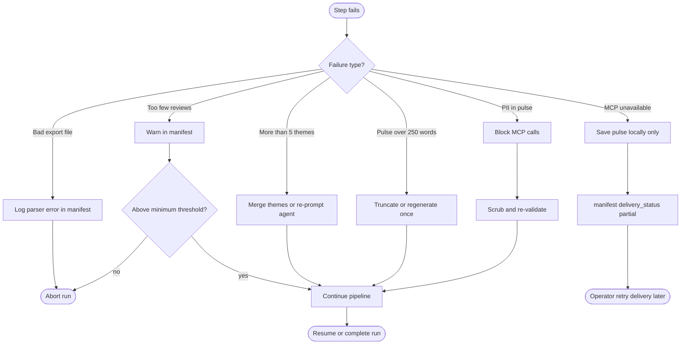

---

### 5. Implementation phase gates

Build order aligned with eval exit criteria:

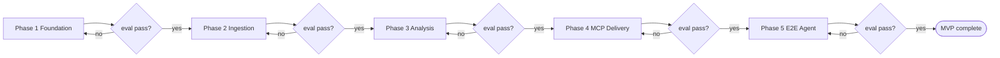

---

## Design principles

| Principle | Implication |
|-----------|-------------|
| **MCP for Google** | Docs and Gmail only through MCP tools; no direct Google API clients in application logic |
| **Public data only** | Review files from store export downloads; no authenticated scraping |
| **Deterministic where possible** | Parsing, date filters, and PII rules are repeatable; agent handles labels, actions, and polish |
| **Eval-gated phases** | Each phase has `eval.md` exit criteria before the next phase starts |
| **No PII in artifacts** | Scrub before any MCP call or file write intended for sharing |
| **Human in the loop for send** | MVP creates drafts; operator sends after review |
| **Traceability** | Quotes link to review ids internally; manifest records each run |

---

## Responsibility split: agent vs pipeline vs human

| Concern | Owner | Rationale |
|---------|-------|-----------|
| Parse CSV/JSON exports | **Pipeline** | Format must be exact and testable |
| Date window filter | **Pipeline** | Same inputs → same review set |
| Theme count cap (≤5) | **Pipeline + LLM** | Pipeline enforces count; LLM names themes |
| Top 3 ranking | **Pipeline** (rule) + **LLM** (narrative) | Rule documented in decision.md; LLM polishes descriptions |
| Quote selection | **Pipeline** (guided) | Deterministic pick + PII redaction |
| Action ideas | **LLM** (with fallback) | Synthesis task; deterministic template as fallback |
| Word limit (≤250) | **Pipeline** | Hard constraint |
| PII scrub / detect | **Pipeline** | Fail closed; non-negotiable |
| Pulse polish | **LLM** (with fallback) | Tone and brevity refinement; deterministic draft as fallback |
| Create Google Doc | **Agent via Docs MCP** | OAuth and API via MCP host |
| Create Gmail draft | **Agent via Gmail MCP** | Same |
| Send email | **Human operator** | Accountability and final edit |
| Weekly export download | **Human operator** | Public exports; no automation in MVP |

---

## Components

### 1. AI agent (orchestrator)

- **Role:** Run the weekly job from a single prompt or skill; choose tools; recover from partial failures.
- **Host:** Cursor Agent with configured MCP servers and project rules/skills.
- **Artifacts:** System/user prompts, optional skill describing the weekly run checklist.
- **Does not:** Hold Google OAuth secrets; call Gmail/Docs REST directly.

**Agent responsibilities in detail**

| Responsibility | Description |
|----------------|-------------|
| **Orchestration** | Follow ordered checklist: ingest → analyze → validate → deliver → manifest |
| **Synthesis** | Name themes in plain language, draft action ideas, polish pulse tone |
| **Tool use** | Invoke pipeline steps and MCP tools; pass structured payloads |
| **Guardrails** | Stop if PII gate fails or exports missing; never bypass validation |
| **Operator comms** | Summarize run outcome: links, warnings, next steps |

**Agent inputs each run**

- Fresh exports in `data/raw/` (or explicit paths from config)
- Current config (app name, window, limits, draft recipient)
- Prior manifest optional (for context only—not required MVP)

**Agent outputs each run**

- Completed or partial pipeline artifacts
- MCP-created Doc URL and Gmail draft reference
- Run manifest with status and counts

### 2. Local pipeline (repository)

| Module | Responsibility |
|--------|----------------|
| **Ingestion** | Parse App Store / Play Store export formats into a canonical schema |
| **Window filter** | Keep reviews from the last 8–12 weeks (configurable) |
| **Theme engine** | Cluster or classify into ≤5 themes; LLM refines labels |
| **Pulse generator** | Produce structured pulse: 3 themes, 3 quotes, 3 actions, ≤250 words |
| **LLM layer (Groq)** | Theme labeling, action synthesis, pulse polish (3 calls/run) |
| **PII guard** | Strip/redact usernames, emails, IDs from quotes and body text |
| **Manifest writer** | Record run metadata, links, and warnings per ISO week |

#### Stage inputs and outputs

| Stage | Reads | Writes | Key metrics |
|-------|-------|--------|-------------|
| Ingestion | `data/raw/*` exports | `data/processed/reviews.jsonl` | Count by platform, date range, ratings |
| Theme analysis | `reviews.jsonl` | `data/processed/themes.json` | Theme count (≤5), reviews per theme |
| Pulse generation | `themes.json`, `reviews.jsonl` | `data/output/pulse.md`, `pulse.json` | Word count, quote source ids |
| PII guard | `pulse.md` | Pass/fail flag in manifest | Violations list (internal only) |
| Manifest | All above + MCP results | `data/runs/YYYY-Www/manifest.json` | delivery_status, links |

Canonical review record (example):

```json
{
  "id": "hash-of-source-fields",
  "platform": "ios|android",
  "rating": 1,
  "title": "",
  "text": "",
  "review_date": "2026-05-01",
  "source_file": "app_store_reviews.csv"
}
```

### 3. Groq LLM integration layer (ADR-006)

Groq Cloud provides the **agent-assisted synthesis** capability per ADR-006. The deterministic pipeline handles parsing, counting, and PII; the LLM handles labeling, synthesis, and polish. All LLM calls have deterministic fallbacks.

#### LLM call pattern

The pipeline makes **exactly 3 LLM calls per weekly run**, regardless of review volume:

| Call | Purpose | Input | Output | Fallback |
|------|---------|-------|--------|----------|
| **Theme labeling** | Name clusters from sample reviews | ≤5 themes × 5 sample reviews (200 chars each) | Label + description per theme | Hardcoded `THEME_LABELS` map |
| **Action generation** | Draft specific action ideas | Top 3 theme summaries + 3 quotes | 3 action objects (text, kind, theme) | Template: "Review X feedback..." |
| **Pulse polish** | Refine tone, brevity, readability | Full draft pulse markdown | Polished pulse markdown | Unpolished deterministic draft |

#### Token budget

Groq free tier limits and estimated per-run consumption:

| Metric | Groq limit | Per-run usage | Headroom |
|--------|------------|---------------|----------|
| Requests/min | 30 | 3 | 27 spare |
| Requests/day | 1,000 | 3 | 997 spare |
| Tokens/min | 12,000 | ~3,700 | ~8,300 spare |
| Tokens/day | 100,000 | ~3,700 | ~96,300 spare |

**Key design decisions:**

- **Batch, not per-review**: LLM never sees all 463 reviews; it sees ≤25 sample excerpts (5 per theme). Token usage is independent of total review count — no need to reduce data volume.
- **Deterministic fallback**: If `GROQ_API_KEY` is unset or any LLM call fails, the pipeline produces a valid pulse using hardcoded labels and template actions. Quality is lower but the pipeline never blocks.
- **Rate-limit safety**: At ~3,700 tokens/run, the daily budget supports ~27 full runs — far more than the intended weekly cadence (1 run/week).
- **Config toggle**: `analysis.llm_enabled` in `config/default.yaml` controls LLM usage; `llm_model` and `llm_max_tokens` are tunable.

#### Why Groq

- Fast inference (sub-second per call) suits a CLI pipeline
- Free tier sufficient for weekly cadence
- Structured JSON output mode compatible with `llama-3.3-70b-versatile`
- No additional infrastructure needed beyond an API key

### 4. MCP integration layer

MCP servers are configured in the **host environment** (e.g. Cursor MCP settings). The agent invokes tools by name; the repo documents **expected tool contracts** (inputs/outputs), not server implementation.

| Server | Typical tools (names vary by server) | Use in WeeklyPulse |
|--------|--------------------------------------|---------------------|
| **Google Docs MCP** | Create document, append/replace body, optionally share link | Persist formatted weekly pulse for archival and editing |
| **Gmail MCP** | Create draft, set to/subject/body | Deliver pulse to operator inbox for review/send |

#### Expected Docs MCP interaction

| Field | Value / convention |
|-------|-------------------|
| **When called** | After PII gate passes |
| **Title** | `WeeklyPulse — Groww — YYYY-Www` (or config override) |
| **Body** | Full pulse: header, top 3 themes, quotes, actions |
| **Return** | Document URL or id for manifest and email link |
| **Failure** | No Gmail draft with broken link; manifest `delivery_status: partial` |

#### Expected Gmail MCP interaction

| Field | Value / convention |
|-------|-------------------|
| **When called** | After Doc created (or in parallel if no link required—see ADR-008) |
| **To** | Operator email or team alias from config |
| **Subject** | `WeeklyPulse — Groww — YYYY-Www` |
| **Body** | Per ADR-008: full pulse **or** short teaser + Doc link |
| **Send** | **Draft only** in MVP—operator sends manually |
| **Return** | Draft id for manifest |

#### Why MCP instead of in-repo APIs

- Credentials and token refresh stay in the IDE/host MCP configuration
- Agent naturally invokes tools during a conversational or skill-driven run
- Swapping MCP server implementations does not require rewriting application code
- Aligns with constraint: no Google API keys in the repository

### 5. Pulse document template

Structure every weekly pulse follows (content varies; shape is fixed):

```text
WeeklyPulse — Groww
Week: YYYY-Www (date range)
Generated: YYYY-MM-DD

## Top themes this week
1. [Theme A] — [one line: what users are saying]
2. [Theme B] — [one line]
3. [Theme C] — [one line]

## What users said
• "[Quote 1]" — [optional: ★ rating, platform]
• "[Quote 2]" — …
• "[Quote 3]" — …

## Suggested actions
1. [Action tied to theme/quote]
2. [Action …]
3. [Action …]
```

**Constraints:** ≤250 words in body; no usernames/emails/IDs; quotes anonymized; scannable in under 2 minutes.

### 6. Configuration and secrets

| Item | Where it lives |
|------|----------------|
| Review export paths | Repo config or env (e.g. `data/raw/`) |
| Date window, theme cap | `config.yaml` or env |
| Google identity / OAuth | MCP server config only (host) |
| Model choice | Host / agent settings |
| Groq API key | `.env` only (never committed) |

### 7. Run manifest (observability)

Each run emits a manifest under `data/runs/YYYY-Www/manifest.json` (or equivalent).

**Purpose:** Audit trail for operators and future debugging—without storing review text or PII.

| Field group | Fields |
|-------------|--------|
| **Run identity** | `run_id`, `week_label`, `started_at`, `completed_at`, `status` |
| **Inputs** | Export filenames, checksums, `reviews_in_window_count` |
| **Analysis** | `theme_count`, `themes[]` (labels + counts), `top_3[]`, ranking rule version |
| **Pulse** | `word_count`, `quote_source_ids[]`, `pii_gate` (pass/fail) |
| **Delivery** | `doc_url`, `draft_id`, `delivery_status` (complete / partial / failed / blocked_pii) |
| **Warnings** | Low volume, parse errors, truncated pulse, MCP retries |

Example manifest shape (illustrative):

```json
{
  "week_label": "2026-W22",
  "app": "Groww",
  "reviews_in_window_count": 142,
  "theme_count": 4,
  "top_3": ["KYC verification", "Withdrawal delays", "App crashes"],
  "word_count": 238,
  "pii_gate": "pass",
  "delivery_status": "complete",
  "doc_url": "https://docs.google.com/...",
  "draft_id": "..."
}
```

---

## Groww-specific analysis context

Themes should reflect **fintech / investing app** feedback—not generic “app bad” buckets. Common theme areas to expect (not a fixed list):

| Area | Example user concerns |
|------|------------------------|
| **Onboarding & KYC** | Document upload failures, verification delays, name mismatch |
| **Payments & UPI** | Failed transactions, mandate issues, bank linking |
| **Portfolio & statements** | Incorrect holdings, statement download, tax docs |
| **Withdrawals** | Slow credit, failed withdrawal, limits |
| **Trading & orders** | Order rejection, slippage, market hours confusion |
| **App quality** | Crashes, login, notifications, performance |
| **Support** | No callback, unresolved tickets, chat quality |

The agent may name themes differently each week but should stay **recognizable to Groww stakeholders**.

---

## Quality attributes

| Attribute | Target | How we verify |
|-----------|--------|---------------|
| **Accuracy** | Quotes traceable to real reviews | Source ids in pulse.json |
| **Privacy** | Zero PII in shared artifacts | PII gate + eval negative tests |
| **Brevity** | ≤250 words | Automated word count |
| **Actionability** | 3 concrete next steps | Product rubric in Phase 3 eval |
| **Repeatability** | Same exports → same review set | Deterministic ingest |
| **Operability** | Weekly run ≤30 min (excl. download) | Phase 5 E2E timing |
| **Recoverability** | Partial MCP failure leaves local pulse | Failure flow (System flows §4) |

---

## Operator journey (detailed)

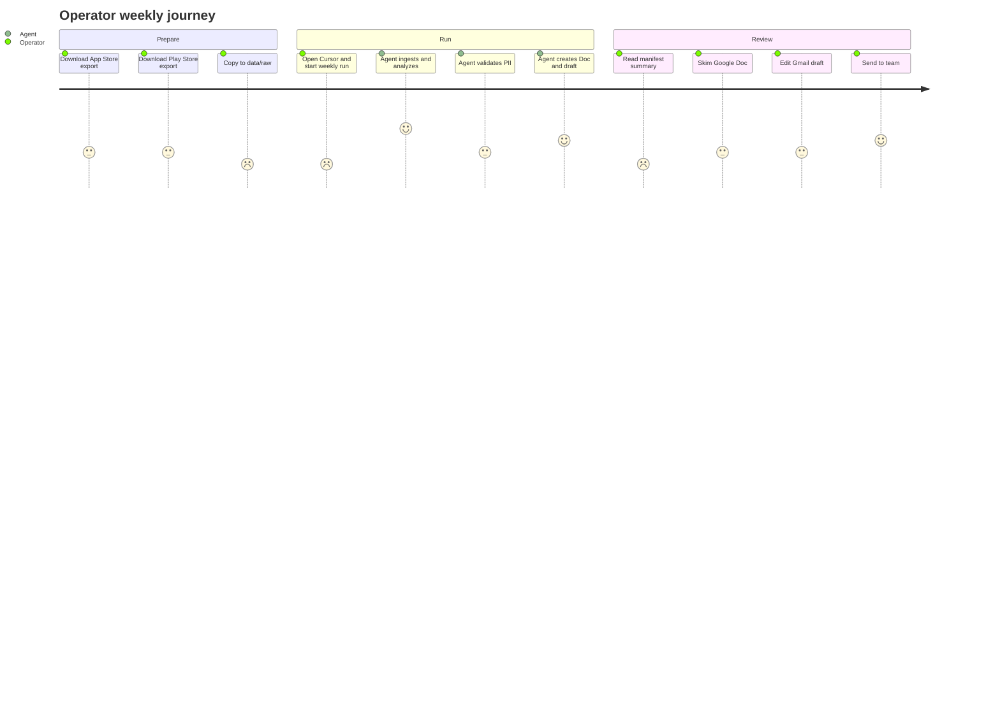

---

## Data flow (step summary)

| Step | Action | Output |
|------|--------|--------|
| 1 | Operator places public exports in `data/raw/` | Raw CSV/JSON files |
| 2 | Ingest and normalize | `data/processed/reviews.jsonl` |
| 3 | Theme analysis | `data/processed/themes.json` |
| 4 | Pulse generation | `data/output/pulse.md`, `pulse.json` |
| 5 | PII guard | Pass/fail gate before MCP |
| 6 | Docs MCP | Google Doc with weekly pulse |
| 7 | Gmail MCP | Draft email for operator |
| 8 | Manifest + human review | `data/runs/YYYY-Www/manifest.json` |

See **[Architecture diagrams](#architecture-diagrams)** (context, pipeline, sequence) and **§ System flows** for supplementary views.

---

## Repository layout (target)

```
WeeklyPulse/
├── ProblemStatement.md
├── docs/
│   ├── architecture.md
│   ├── phase-wise-implementation-plan.md
│   ├── decision.md
│   └── phases/
│       ├── phase-01-foundation/eval.md
│       ├── phase-02-ingestion/eval.md
│       ├── phase-03-analysis/eval.md
│       ├── phase-04-delivery-mcp/eval.md
│       └── phase-05-e2e/eval.md
├── config/
├── data/
│   ├── raw/
│   ├── processed/
│   ├── output/
│   └── runs/
├── src/                    # ingestion, themes, pulse, pii
├── prompts/                # agent system/user templates
└── .cursor/                # rules, MCP docs pointers
```

---

## Failure modes and handling

| Failure | Behavior |
|---------|----------|
| Missing or malformed export | Abort run; manifest notes file and parser error |
| Fewer than N reviews in window | Warn in manifest; continue only if above minimum threshold |
| Theme count greater than 5 | Merge or re-prompt until ≤5 |
| Pulse over 250 words | Auto-truncate or regenerate once |
| PII detected post-generation | Do not call MCP; fix pulse and re-validate |
| MCP unavailable | Save pulse locally; manifest `delivery_status: partial` |

See **System flows §4 — Failure and recovery** for the decision diagram.

---

## Security and compliance

- Treat review exports as **sensitive business data**; do not commit raw exports to git (use `.gitignore`).
- **No PII** in Docs, Gmail, or committed outputs.
- MCP servers run with the operator’s Google account; least-privilege scopes on the MCP side.
- No store-login scraping or credential storage for App Store Connect / Play Console in this project.
- Quotes are **anonymized**; internal review ids are for traceability only and do not appear in Doc/email.
- If a quote cannot be scrubbed safely, **replace** with a different quote or paraphrase (document rule in decision.md).

---

## Non-functional constraints (from problem statement)

| Constraint | Architecture enforcement |
|------------|-------------------------|
| Public exports only | Ingestion reads files from operator drop folder; no store API clients |
| Max 5 themes | Theme engine caps output; merge if exceeded |
| Top 3 in note | Pulse template and pulse.json schema |
| ≤250 words | Pulse generator check before PII gate |
| MCP for Google | Delivery only through Docs/Gmail MCP tools |
| No PII | PII guard fail-closed before MCP |

---

## Related documents

- [Problem statement](../ProblemStatement.md)
- [Phase-wise implementation plan](./phase-wise-implementation-plan.md)
- [Architecture decisions](./decision.md)
- Phase evaluations: [docs/phases/](./phases/)
