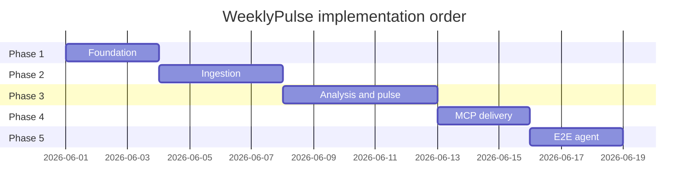
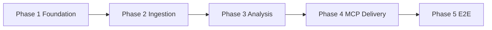

# WeeklyPulse — Phase-wise implementation plan

This plan describes **what we build and validate**, phase by phase, to deliver WeeklyPulse as an **AI agent with MCP** for Google Docs and Gmail. It focuses on activities, outcomes, and decisions—not implementation code.

Each phase ends only when its [eval.md](./phases/) exit criteria pass. Material choices are recorded in [decision.md](./decision.md). Architecture and flows live in [architecture.md](./architecture.md).

---

## How to use this plan

1. Read the phase **objective** and **scope** before starting work.
2. Complete activities in order unless a dependency note says otherwise.
3. Resolve **decisions** during the phase and log them in [decision.md](./decision.md).
4. Run the linked **eval** checklist; do not start the next phase until it passes.
5. Keep **evidence** (manifests, screenshots, sample outputs without PII) for sign-off.

---

## Phase summary

| Phase | Name | What we achieve | Typical focus | Eval |
|-------|------|-----------------|---------------|------|
| **1** | Foundation | Project ready; MCP connected; agent knows the rules | Setup, wiring, governance | [phase-01-foundation/eval.md](./phases/phase-01-foundation/eval.md) |
| **2** | Ingestion | Clean, unified review dataset from public exports | Data quality, windowing | [phase-02-ingestion/eval.md](./phases/phase-02-ingestion/eval.md) |
| **3** | Analysis & pulse | Themes, weekly note, privacy gate | Insight quality, constraints | [phase-03-analysis/eval.md](./phases/phase-03-analysis/eval.md) |
| **4** | Delivery (MCP) | Pulse published to Docs and Gmail via MCP | Integration, operator handoff | [phase-04-delivery-mcp/eval.md](./phases/phase-04-delivery-mcp/eval.md) |
| **5** | E2E agent | One repeatable weekly run end-to-end | Orchestration, operations | [phase-05-e2e/eval.md](./phases/phase-05-e2e/eval.md) |

*Dates are illustrative; adjust to your schedule.*

---

## Cross-phase dependencies

**Gate rule:** Do not start Phase *N+1* until Phase *N* eval is passed.

---

## Phase 1 — Foundation

### Objective

Establish the **operating environment** for WeeklyPulse: folder conventions, configuration, MCP connectivity, agent instructions, and decision log—so every later phase runs on stable ground. No full review pipeline yet.

### Why this phase matters

Without Foundation, later phases risk rework on paths, secrets, MCP tool names, and agent behavior. This phase answers: *Where does data live? Who authenticates to Google? What is the agent allowed to do?*

### Prerequisites

- [ProblemStatement.md](../ProblemStatement.md) agreed
- Cursor (or compatible agent host) available
- Access to Google account for Docs and Gmail MCP smoke tests
- Groww chosen as target app (see ADR-003)

### Scope

**In scope**

- Repository and data directory conventions
- Configuration defaults (app name, date window, theme cap, word limit)
- MCP server setup and smoke verification for Docs and Gmail
- Agent prompts and weekly-run checklist (behavioral spec)
- Initial architecture decisions logged
- Run manifest template (what we will record each week)

**Out of scope**

- Parsing real review exports at scale
- Theme analysis or pulse generation
- Production weekly runs

### Activities (what we do)

#### 1.1 Define project structure and data conventions

- Agree where **raw exports**, **processed data**, **pulse output**, and **run history** live (`data/raw`, `data/processed`, `data/output`, `data/runs`).
- Agree naming for weekly runs (e.g. ISO week `YYYY-Www`).
- Document which folders must **never** be committed (raw exports, secrets).
- Create placeholder structure so operators and the agent know where to read/write.

#### 1.2 Set configuration defaults

- Fix target app: **Groww** (iOS + Android).
- Fix review window: **8–12 weeks** (pick default within range, e.g. 10 weeks).
- Fix analysis limits: **max 5 themes**, **top 3 in pulse**, **≤250 words**.
- Fix delivery targets: draft recipient (self or team alias), subject line pattern, doc title pattern.
- Document how an operator changes these without editing agent prompts.

#### 1.3 Connect and verify MCP servers

- Install/configure **Google Docs MCP** in the agent host.
- Install/configure **Gmail MCP** in the agent host.
- Run **smoke tests**: create a throwaway doc; create a throwaway draft to self.
- Record exact **tool names**, required arguments, and typical responses in project docs (not secrets).
- Confirm OAuth/credentials stay in MCP config only—nothing in the repo.

#### 1.4 Define agent behavior (prompts and checklist)

- Write **system context**: Groww, public exports only, no PII, MCP for Google, eval gates.
- Write **weekly run checklist**: ordered steps from “exports in folder” through “manifest written.”
- Define when the **agent** decides vs when it must **run deterministic steps** (ingest/analyze/PII check).
- Define **stop conditions**: PII fail, MCP fail, missing exports—what the agent tells the operator.

#### 1.5 Governance and decisions

- Seed [decision.md](./decision.md) with accepted ADRs: MCP-not-API, public exports, Groww, theme/pulse rules, PII fail-closed.
- Link each phase to its eval file so sign-off is explicit.

#### 1.6 Run manifest template

- Define fields for every weekly run: timestamp, week id, input file names/checksums, review counts, theme list, word count, PII status, MCP status, doc link, draft reference.
- Clarify manifest is **operational record**, not customer-facing; still no PII.

### Decisions to make in this phase

| Decision | Where to record |
|----------|-----------------|
| Default review window (8, 10, or 12 weeks) | config + decision.md |
| Gmail draft recipient (self vs alias) | config + decision.md |
| Doc title and email subject naming | config + prompts |
| Which MCP server packages/tools we use | docs + smoke notes |

### Roles

| Role | Responsibility in Phase 1 |
|------|---------------------------|
| **Implementer** | Structure, config, MCP smoke, prompts |
| **Operator** | Confirm Gmail/Draft and Drive access works |
| **Reviewer (optional)** | Validate prompts match problem statement |

### Risks and mitigations

| Risk | Mitigation |
|------|------------|
| MCP tool names differ from docs | Smoke test and record actual names |
| Google scopes too broad/narrow | Test create doc + draft only; adjust MCP config |
| Agent prompts too vague | Checklist with explicit stop/go gates |

### Deliverables

- Project layout and config documented
- MCP smoke-test evidence (doc + draft created)
- Agent system prompt + weekly checklist in `prompts/`
- Run manifest template defined
- Phase 1 eval signed off

### Definition of done

An operator can open the project, see where data goes, run MCP smoke tests successfully, and hand the agent a checklist that matches the problem statement—without processing real Groww reviews yet.

---

## Phase 2 — Ingestion

### Objective

Turn **public App Store and Play Store export files** into a single, trustworthy **normalized review dataset** covering the configured time window—ready for theme analysis.

### Why this phase matters

Garbage in → garbage out. If exports are parsed inconsistently, deduplicated incorrectly, or include out-of-window reviews, every theme and quote in the pulse will be wrong. This phase makes the **source of truth** for analysis.

### Prerequisites

- Phase 1 eval passed
- Sample or real Groww export files available locally (not committed to git)
- Documented steps for how operators obtain exports from each store

### Scope

**In scope**

- Understanding export formats for iOS and Android
- Mapping both formats to one **canonical review model**
- Date window filtering (8–12 weeks)
- Deduplication rules across files/platforms
- Ingestion summary stats for operator confidence
- Operator guide: download exports → place in `data/raw`

**Out of scope**

- Theme labeling, sentiment models, pulse writing
- MCP delivery
- Automated download from store consoles (manual export drop only)

### Activities (what we do)

#### 2.1 Obtain and classify source files

- Collect representative **App Store** export(s) for Groww.
- Collect representative **Play Store** export(s) for Groww.
- Note file format (CSV, JSON, column names, date formats, encoding).
- Identify fields available vs required: rating, title, text, date, platform.
- Identify fields that may contain **PII** in raw exports (username, device id)—mark for exclusion from downstream artifacts.

#### 2.2 Define canonical review record

- One record shape for all platforms (see [architecture.md](./architecture.md)).
- Stable **review id** rule: same review always maps to same id on re-ingest.
- Rules for empty title/text, star-only reviews, non-English text (include but flag in stats).
- Platform tag: `ios` vs `android`.

#### 2.3 Normalize and merge

- Parse each export into canonical records.
- Merge iOS + Android into one dataset.
- Apply **deduplication** if the same review could appear twice (document rule).
- Drop or quarantine rows that cannot be parsed (log counts, do not fail silently).

#### 2.4 Apply time window

- Compute “as of” date (run date or configured end date).
- Keep only reviews within **8–12 weeks** per config.
- Report: oldest/newest review date, count excluded by window, count retained.

#### 2.5 Quality checks and ingestion report

- Count by platform, rating (1–5), and week.
- Flag if total in-window reviews below agreed minimum (warn, don’t hide).
- Flag date gaps (e.g. no reviews for 3+ weeks)—informational for operator.
- Write normalized output to `data/processed/reviews.jsonl`.
- Produce human-readable **ingestion summary** for manifest.

#### 2.6 Operator playbook (export refresh)

- Step-by-step: where to download App Store reviews for Groww.
- Step-by-step: where to download Play Store reviews for Groww.
- Where to copy files before a weekly run.
- How often to refresh (typically weekly before pulse run).

### Decisions to make in this phase

| Decision | Options / notes |
|----------|-----------------|
| Default window length | 8, 10, or 12 weeks |
| Handling duplicate reviews | Keep first, keep latest, merge text |
| Minimum review count to proceed | e.g. 50 in-window reviews |
| Non-English reviews | Include all vs filter |

### Roles

| Role | Responsibility in Phase 2 |
|------|-------------------------|
| **Operator** | Provide exports, validate counts feel right |
| **Implementer** | Normalization, window filter, summary |
| **Product (optional)** | Sanity-check volume and date range |

### Risks and mitigations

| Risk | Mitigation |
|------|------------|
| Export format changes | Document format version; fixture samples |
| Low review volume | Warn in summary; define minimum in eval |
| PII in raw exports | Never pass raw usernames to pulse; schema excludes them |

### Deliverables

- Normalized `reviews.jsonl` from sample/real Groww data
- Ingestion summary template populated for one run
- Operator export-download guide
- Phase 2 eval signed off

### Definition of done

Given fresh Groww exports in `data/raw`, the team produces a merged, in-window, canonical review file with a summary an operator can trust—without any theming or email yet.

---

## Phase 3 — Analysis & pulse generation

### Objective

Transform normalized reviews into a **weekly one-page pulse**: max 5 themes internally, **top 3** highlighted, **3 quotes**, **3 action ideas**, **≤250 words**, **PII-safe**—ready for delivery but not yet sent.

### Why this phase matters

This is the **product value** of WeeklyPulse. Leadership and PMs care about clarity, actionability, and trust—not plumbing. Quotes must feel real; themes must match Groww; actions must be usable next week.

### Prerequisites

- Phase 2 eval passed
- `reviews.jsonl` available with sufficient in-window volume
- ADR-007 (theme ranking rule) ready to finalize

### Scope

**In scope**

- Theme discovery and grouping (≤5)
- Ranking top 3 themes for the note
- Quote selection (3 representative, anonymized)
- Action idea generation (3 items tied to themes)
- Pulse document structure and word limit
- PII detection and fail-closed gate
- Review by product sense for Groww-specific relevance

**Out of scope**

- Google Docs / Gmail publishing
- Week-over-week diff or trending charts
- Automated store responses

### Activities (what we do)

#### 3.1 Explore the review corpus

- Scan rating distribution and volume by platform.
- Read a sample of 1–2 star vs 4–5 star reviews for tone.
- Note recurring product areas (onboarding, KYC, payments, statements, withdrawals, crashes, support)—inform theme labels, not hard-coded only.

#### 3.2 Group into themes (max 5)

- Cluster or classify reviews into **at most 5 themes** using Groww-domain keyword matching (deterministic).
- Each theme gets: short label, one-line description, review count, optional avg rating.
- If natural clusters exceed 5, **merge** related themes (document merge rationale in manifest or decision log).
- **Groq LLM then relabels** clusters: sends ≤5 sample reviews per theme to `llama-3.3-70b-versatile` for a Groww-specific label and description. Falls back to hardcoded labels if LLM unavailable.
- Save full theme map to `themes.json` for traceability.

#### 3.3 Rank top 3 themes

- Apply ranking rule (volume, severity weighting, or hybrid—finalize ADR-007).
- Top 3 must appear prominently in the pulse; remaining themes may be omitted from the one-pager or mentioned briefly if word budget allows.
- Document **why** this week’s top 3 were chosen (one sentence in manifest).

#### 3.4 Select three user quotes

- Pick quotes that represent distinct themes or sentiments.
- Prefer **verbatim** review text after redaction—not paraphrase unless export is unusable.
- Strip usernames, emails, order ids, phone fragments.
- Each quote linked to source review id internally (for audit, not for publication).
- Avoid quotes that could identify an individual even without a name.

#### 3.5 Draft three action ideas

- Each action tied to a top theme or quote pattern.
- Actions should be **specific enough** for a PM or support lead (e.g. "Audit KYC retry error copy on Android" vs "Fix KYC").
- Balance: at least one may be quick-win, one may be investigative, one may be cross-functional.
- **Groq LLM generates** actions from theme summaries + quotes. Falls back to template actions ("Review X feedback and prioritize top complaints") if LLM unavailable.
- LLM prompt requests structured JSON output with `kind` tags (quick-win / investigative / cross-functional).

#### 3.6 Compose the weekly pulse

- Fixed structure (see [architecture.md — Pulse document template](./architecture.md)):
  - Header: app name, week range, generated date
  - Top 3 themes (bullets with brief context)
  - 3 quotes (blockquote or italic style)
  - 3 action ideas (numbered)
- Enforce **≤250 words** total body; headings don't need to count if team agrees—document rule in decision.md.
- **Groq LLM polishes** the draft pulse for executive readability: tightens descriptions, improves tone, ensures Groww relevance. Falls back to unpolished draft if LLM unavailable.
- Produce **human-readable** `pulse.md` and **structured** `pulse.json` for manifest and MCP.

#### 3.7 PII and quality gate

- Run automated PII check on full pulse text.
- Checklist: no emails, @handles, phone patterns, “user id”, account numbers.
- **Fail closed**: if gate fails, do not proceed to Phase 4 activities.
- Optional human skim for business quality (rubrics in phase eval).

#### 3.8 Validate against problem statement

- Confirm: top 3 themes, 3 quotes, 3 actions, ≤250 words, no PII.
- Confirm themes are plausible for **Groww** this week.
- Save outputs under `data/output/`.

#### 3.9 Groq LLM rate limit management

The pipeline makes **exactly 3 LLM calls per weekly run** (theme labeling, action generation, pulse polish), regardless of review volume. Token usage is independent of total review count because the LLM only sees sample reviews (≤25 excerpts per run).

**Groq free tier limits:**

| Metric | Limit | Per-run usage | Headroom |
|--------|-------|---------------|----------|
| Requests/min | 30 | 3 | 27 spare |
| Requests/day | 1,000 | 3 | 997 spare |
| Tokens/min | 12,000 | ~3,700 | ~8,300 spare |
| Tokens/day | 100,000 | ~3,700 | ~96,300 spare |

**No data reduction needed:** Since LLM calls only use sample reviews (not the full corpus), running 463 reviews vs 230 reviews produces identical token consumption. The weekly cadence (1 run/week) is well within all rate limits.

**Deterministic fallback:** If `GROQ_API_KEY` is unset or any LLM call fails, the pipeline produces a valid pulse using hardcoded theme labels and template action ideas. Quality is lower but the pipeline never blocks.

### Decisions to make in this phase

| Decision | Record in |
|----------|-----------|
| Theme ranking rule (ADR-007) | decision.md |
| Verbatim vs lightly cleaned quotes | decision.md |
| Word count rules (headings included or not) | decision.md |
| Minimum theme size (e.g. ignore themes with &lt;3 reviews) | decision.md |

### Roles

| Role | Responsibility in Phase 3 |
|------|---------------------------|
| **Groq LLM** | Theme labels, action wording, pulse polish (3 calls/run) |
| **Implementer** | Theme counts, PII gate, structure, word limit, deterministic fallbacks |
| **Product reviewer (optional)** | Groww relevance and action quality |

### Risks and mitigations

| Risk | Mitigation |
|------|------------|
| Themes too generic | Seed with Groww domain examples in prompts; LLM relabels from sample reviews |
| Hallucinated quotes | Trace every quote to review id; LLM never generates quotes |
| Over word limit | Regenerate or trim; log in manifest |
| PII slip-through | Fail closed + eval negative tests |
| Groq rate limit hit | 3 calls/run = ~3,700 tokens; well within 100K/day budget |
| LLM unavailable | Deterministic fallback: hardcoded labels + template actions |

### Deliverables

- `themes.json` with ≤5 themes and top 3 marked
- `pulse.md` and `pulse.json` meeting structure and word limit
- PII gate pass on sample run
- Phase 3 eval signed off (including optional product rubric)

### Definition of done

From `reviews.jsonl` alone, the team produces a pulse a PM could read in under two minutes, forward to leadership, and act on—without Google delivery yet.

---

## Phase 4 — Delivery (MCP)

### Objective

Publish the validated pulse to **Google Docs** and **Gmail** using **MCP tools only**, with clear operator handoff and run manifest entries for traceability.

### Why this phase matters

A pulse in a local folder doesn’t change team behavior. Docs give a durable, editable record; Gmail puts the summary where operators already work. MCP keeps auth out of the repo and matches the agent-first workflow.

### Prerequisites

- Phase 3 eval passed
- `pulse.md` passed PII gate
- Phase 1 MCP smoke tests still valid (tools unchanged)
- ADR-008 ready to finalize (doc vs email as canonical)

### Scope

**In scope**

- Tool contracts for Docs and Gmail MCP (what we send, what we get back)
- Agent delivery sequence: Doc first, then draft (or agreed order)
- Formatting pulse for Doc body and email body per ADR-008
- Subject line and doc title conventions
- Partial failure handling and manifest updates
- Operator verification in Drive and Gmail UI

**Out of scope**

- Sending email automatically without human review (draft only for MVP)
- Sharing doc with external domains
- Direct Google API integration in application code

### Activities (what we do)

#### 4.1 Finalize delivery content model

- Decide **canonical source** (ADR-008): typically Doc holds full pulse; email has teaser + link.
- Define email **To** (self or alias), **Subject** (`WeeklyPulse — Groww — YYYY-Www`), **preheader/teaser** if used.
- Define Doc **title** and heading structure matching `pulse.md`.
- Agree plain-text vs minimal formatting acceptable in Gmail draft.

#### 4.2 Document MCP tool contracts

- **Docs MCP**: create new doc vs update existing weekly doc; parameters (title, body); return value (url, id).
- **Gmail MCP**: create draft; parameters (to, subject, body, optional html); return value (draft id).
- Document failure modes: auth expired, quota, invalid body length.
- Store contracts in project docs for agent prompts—actual tool names from Phase 1 smoke tests.

#### 4.3 Define agent delivery playbook

- Step 1: Confirm PII gate passed (re-check before any MCP call).
- Step 2: Call Docs MCP with formatted pulse; capture link.
- Step 3: Call Gmail MCP with subject, body (and doc link per ADR-008).
- Step 4: Write delivery section to manifest (`doc_url`, `draft_id`, `delivery_status: complete|partial|failed`).
- Step 5: Tell operator exactly what to open and review.

#### 4.4 Execute test delivery

- Use one real Phase 3 pulse (PII-clean).
- Verify Doc content matches pulse (sections, word count, no missing quotes).
- Verify draft appears in Gmail **Drafts** with correct recipient and subject.
- Operator confirms they would send this with at most minor edits.

#### 4.5 Handle partial and failed delivery

- **Doc ok, draft fail**: manifest `partial`; pulse remains local; operator retry Gmail step.
- **Doc fail**: do not create draft with stale link; manifest `failed`; retry Docs only.
- **PII detected at last minute**: abort MCP; return to Phase 3 scrub path.
- Log errors without leaking review text or PII in logs.

#### 4.6 Idempotency for same week

- Agree behavior for re-run same ISO week: update same Doc vs create `Week 22 v2`.
- Document in decision.md so operators aren’t surprised by duplicate docs.

### Decisions to make in this phase

| Decision | Record in |
|----------|-----------|
| Doc vs email canonical (ADR-008) | decision.md |
| Update vs new doc on re-run | decision.md |
| Auto-send vs draft-only | decision.md (MVP: draft-only) |

### Roles

| Role | Responsibility in Phase 4 |
|------|---------------------------|
| **Agent** | Invoke MCP tools in order |
| **Operator** | Verify Doc and draft in Google UI |
| **Implementer** | Playbook, manifest fields, failure handling |

### Risks and mitigations

| Risk | Mitigation |
|------|------------|
| MCP tool behavior differs from contract | Re-smoke; update playbook |
| Formatting loss in Doc | Accept minimal formatting; prioritize content |
| Wrong recipient | Config check + operator verification |

### Deliverables

- Documented MCP tool contracts and agent delivery playbook
- One verified Google Doc + one Gmail draft from same pulse
- Manifest delivery section populated
- Phase 4 eval signed off

### Definition of done

After analysis, the operator receives a Doc link and a Gmail draft without copy-pasting pulse text manually; manifest shows success and links.

---

## Phase 5 — End-to-end agent orchestration

### Objective

Combine all prior phases into **one repeatable weekly ritual**: operator drops exports → agent runs ingest → analyze → validate → MCP deliver → manifest → human review.

### Why this phase matters

Phases 1–4 prove pieces; Phase 5 proves **the product works as a system** on a cadence a team could adopt every Monday (or chosen day).

### Prerequisites

- Phases 1–4 evals passed
- Fresh Groww exports available for a full trial run
- Operator available for final draft review

### Scope

**In scope**

- Single master prompt/skill for weekly run
- Ordered handoff between deterministic steps and agent steps
- Run folder per week (`data/runs/YYYY-Www/`)
- Operator playbook from export download through send
- Cold-start documentation for a new operator
- MVP sign-off against [ProblemStatement.md](../ProblemStatement.md) success criteria

**Out of scope**

- Unattended cron without human export drop
- Multi-app support
- Slack/dashboard notifications

### Activities (what we do)

#### 5.1 Unify the weekly run script (logical, not code)

- One checklist document the agent follows every time.
- Explicit **entry condition**: exports present in `data/raw`, config loaded, MCP servers up.
- Explicit **exit condition**: manifest complete, operator notified with doc + draft pointers.

#### 5.2 Run a full golden-path E2E

- Operator downloads latest Groww exports.
- Operator starts weekly run in Cursor with master prompt.
- Pipeline produces reviews → themes → pulse → PII pass → Doc → draft → manifest.
- Measure wall-clock time (target: under 30 minutes excluding export download).
- Confirm **no manual copy-paste** of pulse into Google products.

#### 5.3 Run a second week (or re-run) simulation

- Use a different ISO week folder or updated exports.
- Verify manifests don’t overwrite each other incorrectly.
- Verify archive/overwrite rules from Phase 4 idempotency decision.

#### 5.4 Test guardrails

- Simulate PII failure: agent must stop before MCP.
- Simulate missing export: clear error and manifest note.
- Document what the operator does for each case.

#### 5.5 Write operator playbook (README section)

- **Weekly cadence**: when to pull exports, when to run agent, when to send email.
- **Before you run**: checklist (exports, MCP, config).
- **After you run**: verify manifest, open draft, edit Doc if needed, send.
- **Troubleshooting**: links to failure flow in architecture.md.

#### 5.6 MVP sign-off

- Map each [ProblemStatement.md](../ProblemStatement.md) success criterion to E2E evidence.
- Confirm all phase evals signed.
- Confirm no open blocking decisions in decision.md.
- Redacted example manifest committed for future operators.

### Decisions to make in this phase

| Decision | Record in |
|----------|-----------|
| Fixed weekday for weekly run | operator playbook |
| Who receives draft (individual vs shared alias) | config |
| Whether to commit redacted example manifest | team norm |

### Roles

| Role | Responsibility in Phase 5 |
|------|---------------------------|
| **Operator** | Full E2E run and draft send (or approve) |
| **Implementer** | Playbook, manifest example, guardrail tests |
| **Stakeholder (optional)** | Accept MVP against success criteria |

### Risks and mitigations

| Risk | Mitigation |
|------|------------|
| Agent skips a step | Numbered checklist with mandatory confirmations |
| Operator forgets export refresh | Playbook + calendar reminder |
| Drift from prompts over time | Version prompts; link to decision.md |

### Deliverables

- Master weekly-run prompt/skill
- Operator playbook in README (or linked doc)
- Completed E2E with redacted manifest example
- Phase 5 eval signed → **MVP complete**

### Definition of done

A new operator can follow documentation only, run one weekly pulse for Groww, and end with a sent (or approved) email plus archived Doc—repeatable next week without engineering help.

---

## Agent + MCP operating model

| Step | Who does it | What happens |
|------|-------------|--------------|
| Place exports | **Operator** | Downloads public CSV/JSON into `data/raw` |
| Ingest | **Deterministic pipeline** | Normalized `reviews.jsonl` + summary |
| Theme & pulse draft | **Groq LLM + pipeline** | Themes (LLM-labeled), quotes (deterministic), actions (LLM-generated), word limit |
| PII validation | **Deterministic gate** | Pass/fail; blocks delivery on fail |
| Google Doc | **Agent via Docs MCP** | Create/update doc; return URL |
| Gmail draft | **Agent via Gmail MCP** | Draft to configured recipient |
| Manifest | **Pipeline + agent** | Run record under `data/runs/` |
| Send email | **Human operator** | Review draft, edit, send |

The agent must **never** skip PII validation or call MCP with unvalidated pulse content.

---

## Phase 6 — Cloud Automation & Deployment (GitHub Actions & Railway)

### Objective
Migrate the MVP from a local Cursor Agent to a headless cloud deployment. Run the weekly pulse automatically via a GitHub Action (cron) and provide an API trigger via a Railway deployment.

### Scope
**In scope**
- `.github/workflows/weekly_pulse.yml` for automated runs.
- `railway.json` and a FastAPI wrapper for manual trigger and status viewing on Railway.
- Transition from Local Google OAuth to Google Service Accounts.
- End-to-end headless orchestration via Python, bypassing Cursor MCP.

**Out of scope**
- Automated App Store export downloading (exports must still be uploaded or managed via data pipelines).

### Definition of done
The weekly run executes on a schedule in GitHub Actions without opening a local IDE, and a Railway backend successfully serves a health check and trigger endpoint.

---

---

## Related documents

- [architecture.md](./architecture.md)
- [decision.md](./decision.md)
- [ProblemStatement.md](../ProblemStatement.md)
- Phase evaluations: [docs/phases/](./phases/)
